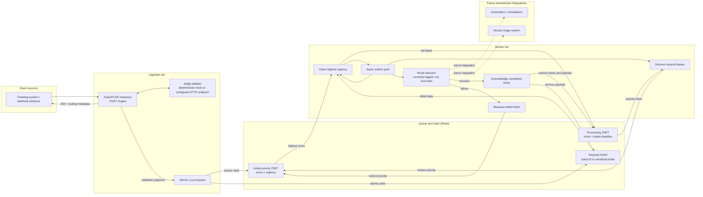

# JevStream

JevStream is a small asynchronous triage service that judges incoming tickets, indexes them by urgency in a Redis sorted set, and lets a worker route the highest-priority items first.

The included `mock` judge makes the project runnable locally. It is a deterministic keyword-based development adapter, not Jev and not an AI model. To connect a hosted judgment service, set `JUDGE_MODE=http` and point `JUDGE_API_URL` at an endpoint that implements the HTTP contract below. The adapter is deliberately provider-neutral; it does not assume an undocumented TypeSafe endpoint or SDK.

## Core Philosophy

Queue prioritization often needs a compact, validated decision rather than generated prose that another service must parse. JevStream explores that boundary: a judgment adapter returns a bounded urgency score and a department, and Redis uses the urgency as the sorted-set score for priority retrieval. Sorted-set updates and retrieval are logarithmic in the queue size; the worker uses atomic Lua scripts and expiring claims to support recovery after a worker interruption.

This repository is an architectural MVP, not a benchmark or a production Jev integration. The mock judge is deterministic, and the HTTP adapter accepts JevStream's own contract. Latency, provider accuracy, throughput, and production readiness depend on the configured judge, Redis deployment, and downstream handler.

## Architecture



The ZSET score is the urgency value, so workers claim the highest score first. Lua scripts make enqueue, claim, acknowledgement, retry, and expired-claim recovery atomic. A worker crash leaves the ticket in a processing ZSET until its lease expires, after which another worker can recover it. Delivery is at least once: handlers should be idempotent if they perform external side effects.

## Run locally

Requirements: Python 3.11+ and Redis 6.2+.

```sh
python -m venv .venv
source .venv/bin/activate
pip install -r requirements.txt
cp .env.example .env
```

Start Redis separately, then run the API and worker in two terminals:

```sh
uvicorn main:app --reload
```

```sh
python worker.py
```

## Quickstart

```sh
curl -X POST http://127.0.0.1:8000/ingest \
  -H 'Content-Type: application/json' \
  -d '{"ticket_id":"tk_1002","text":"URGENT: Database is down after migration; roll back immediately!"}'
```

The response includes the urgency, department, and threshold-based destination. A duplicate `ticket_id` already queued or being processed returns HTTP 409; acknowledged IDs may be reused. Omit `ticket_id` to have the API generate one.

## HTTP judge contract

With `JUDGE_MODE=http`, JevStream sends a POST request to `JUDGE_API_URL`, optionally with a bearer token from `JUDGE_API_KEY`:

```json
{
  "text": "Customer's ticket text",
  "questions": {
    "urgency": {"type": "score", "minimum": 0, "maximum": 1},
    "department": {
      "type": "choice",
      "options": ["billing", "technical", "security"]
    }
  }
}
```

The endpoint must return JSON matching this schema; values are validated before queueing:

```json
{"urgency": 0.94, "department": "security"}
```

This is JevStream's adapter contract, not a claim about TypeSafe's official API shape. Set `AUTO_ROUTE_THRESHOLD` to change the automation threshold. The worker currently simulates routing by logging; connect the `handle` function to idempotent downstream actions before production use.

## Settings

Configuration is read from environment variables or `.env`: `REDIS_URL`, `JUDGE_MODE`, `JUDGE_API_URL`, `JUDGE_API_KEY`, `JUDGE_TIMEOUT_SECONDS`, `AUTO_ROUTE_THRESHOLD`, `CLAIM_LEASE_SECONDS`, and `WORKER_POLL_INTERVAL_SECONDS`. Redis keys can be customized with `QUEUE_KEY`, `PROCESSING_KEY`, and `PAYLOAD_KEY`.